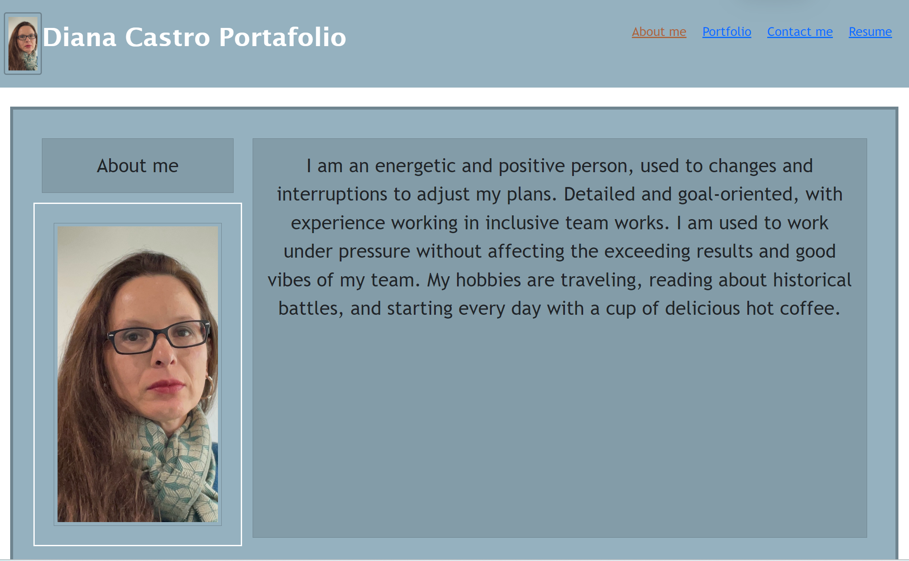
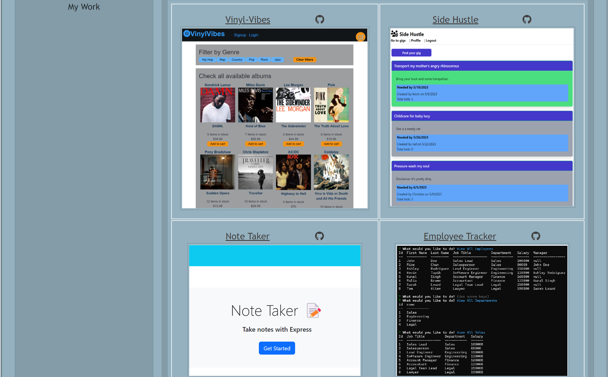

# Diana Castro React Portfolio

## Description
This is my portfolio, a site for prospective employers to go through different applications I have created, and evaluate the different skills I have acquired as a full-stack developer.

  

## Table of Contents
- [Installation](#installation)
- [Usage](#usage)
- [DeployeedURL](#deployeedurl)
- [Tests](#tests)
- [Email](#email)
- [GitHub](#github)
- [License](#license)

## Installation
Create and administered GitHub Repo, merged multiple branches. Technologies used: React, Node.js.  Access https://github.com/dimartoro/my-portfolio-react.git for code details. 

## Usage
My Portfolio shows employers some very interesting applications I have developed.

## Deployeedurl
https://dimartoro.github.io/my-portfolio/

## Tests
Accessing the applications through the Portfolio links will test them.  
P1. Diana Castro Portfolio:           
        
P2. My Work:          
 

## Email
Contact me with additional questions at this email address:

dimartoro@gmail.com

## GitHub
https://github.com/dimartoro

## License
This app is licensed under [MIT](https://choosealicense.com/licenses/mit/) license

